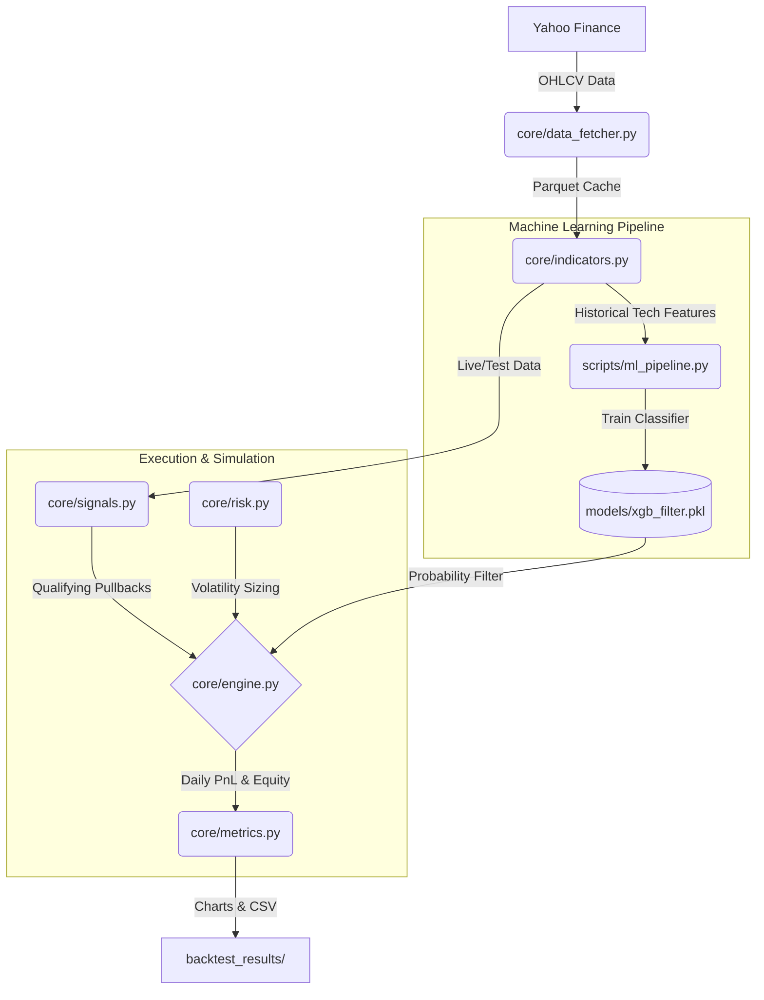

# Smart Alpha 3.0: Complete Codebase Explanation

This document provides a comprehensive, module-by-module breakdown of the Smart Alpha 3.0 quantitative trading engine. The architecture is split into three main components: Core Logic, Machine Learning, and Execution Scripts.

### System Architecture Flow

---

## 1. Core Logic Modules (`core/`)

These files house the absolute bedrock of the trading system—handling everything from raw data ingestion to technical calculations and portfolio risk math.

### `core/data_fetcher.py`
**Purpose**: Handles all data ingestion from Yahoo Finance.
*   **Mechanics**: Initializes a `DataFetcher` class that downloads Open, High, Low, Close, Volume (OHLCV) data.
*   **Caching**: To drastically speed up backtests, it saves downloaded data as `.parquet` files in the `data_cache/` directory. It only re-downloads data if the requested parquet file is missing.
*   **Constants**: Contains hardcoded lists of the `NIFTY_50_TICKERS` and `SECTOR_INDICES` which it fetches via the `fetch_all()` method.

### `core/indicators.py`
**Purpose**: Pre-computes all mathematical technical indicators.
*   **Mechanics**: Takes a raw price dataframe and calculates:
    *   **Moving Averages**: SMA 10, 50, 100, 200 and EMA 20.
    *   **Volatility (ATR)**: Calculates Wilder’s Average True Range (14 & 20 periods) for stop-losses and sizing.
    *   **Keltner Channels (KC)**: Uses the 20-EMA and 20-ATR to construct an upper and lower volatility band.
    *   **Momentum (ROC_90)**: The 90-day Rate of Change to identify long-term uptrends.
    *   **Mean Reversion (RSI_3)**: A hyper-fast 3-period Relative Strength Index to identify deep, short-term oversold conditions.

### `core/signals.py`
**Purpose**: The algorithmic rule-set that defines a "buy" setup.
*   **`generate_signals`**: Returns `True` if a stock meets the strict pullback criteria: It must be in a long term uptrend (`Close > SMA_50`) but experiencing a sharp 3-day crash (`RSI_3 <= 30` OR `Close < KC_Lower`).
*   **`rank_candidates`**: Ranks all qualifying stocks based on "Smooth Momentum" (`ROC_90 / ATR_20`). This ensures the engine only buys pullbacks in the smoothest, most reliable trending stocks, penalizing highly volatile erratic ones.

### `core/risk.py`
**Purpose**: Calculates how many shares to buy using **Volatility Targeting**.
*   **Mechanics**: Rather than risking a fixed % of capital, it uses `ATR14` to standardize risk. 
*   **Formula**: `Shares = (Equity * Target Volatility * Volatility Multiplier) / ATR14`. 
*   **Limits**: Even if volatility is extremely low, it caps maximum position sizing at 100% of available equity (1x leverage max). It also calculates the hard stop-loss level at `Entry - (2.5 * ATR14)`.

### `core/engine.py`
**Purpose**: The heart of the simulation. It iterates through historical data day-by-day and manages the portfolio.
*   **Daily Loop Logic**:
    1.  **Process Exits**: Checks if currently open trades hit their Stop Loss, Time Stop (10 days), or Primary Exit (`RSI_3 > 80` or `Close > SMA_10`).
    2.  **Update Equity**: Re-evaluates the daily portfolio value.
    3.  **Evaluate Regimes**: Checks the Nifty 50 `SMA_100` and overall market breadth. If the market is crashing, it freezes all buying.
    4.  **Evaluate Entries**: Runs the ML filter on the top-ranked signal. If the ML predicts a >50% chance of winning, it calculates position sizing (via `risk.py`) and executes the trade at the next day's Open.

### `core/metrics.py`
**Purpose**: Post-trade analytics and visualizations.
*   **Mechanics**: Calculates CAGR, Sharpe Ratio, Profit Factor, and Win Rates from the equity curve. 
*   **Monte Carlo**: Contains `run_monte_carlo` and `run_monte_carlo_projection` which resample daily returns 1,000 times to simulate alternate historical realities and project future wealth to 2030.

---

## 2. Machine Learning Pipeline (`scripts/`)

These scripts give the engine its "smart" filtering capabilities.

### `scripts/ml_pipeline.py` & `scripts/train_custom_ml.py`
**Purpose**: To prevent the engine from catching "falling knives" (pullbacks that keep crashing).
*   **Dataset Building**: Iterates over history. Every time the base algorithm said "BUY", the script records the technical features (RSI, distance from SMA, Keltner distance) and then peeks 5 days into the future. If the stock bounced by at least 1%, the `Target` is `1` (Win). Else, `0` (Loss).
*   **Training**: Splits the chronological data (70% Train, 30% Test). It trains an `XGBoost Classifier` on the features to learn what a "good" pullback looks like versus a "bad" one.
*   **Output**: Saves the trained brain as a `.pkl` file (e.g., `models/xgb_filter.pkl`), which `engine.py` loads during backtesting.

---

## 3. Execution & Orchestration

These are the top-level scripts you actually run in the terminal.

### `main.py`
**Purpose**: The primary backtester for the Nifty 50 universe.
*   **Flow**: It orchestrates the entire pipeline. It calls the Data Fetcher -> Precomputes Indicators -> Initializes the Backtest Engine -> Triggers the Monte Carlo simulations -> Prints the console report and saves the charts to `backtest_results/`.

### `my_port_backtest.py`
**Purpose**: A clone of `main.py` tailored specifically for your custom portfolio of ETFs and specific small-caps. 
*   **Customization**: It subclasses the main engine (`MyPortEngine`) to ensure your specific basket of stocks is evaluated, bypassing the strict Nifty 50 rules, and utilizes the `custom_xgb_filter.pkl` model trained exclusively on your assets. Output is routed to the `my port back/` directory.

### `forward_test.py`
**Purpose**: The script used for **Live Daily Trading**.
*   **Mechanics**: Unlike `main.py` which simulates history, this script only downloads the last 200 days of data, calculates indicators for *today*, and prints out exactly which stocks triggered a valid buy signal *right now*. It outputs a clean console summary telling you what to buy at tomorrow's open.
